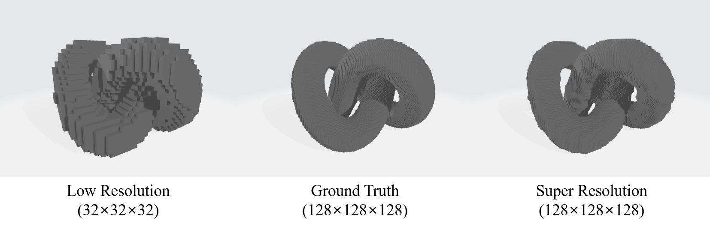

# Voxel-Super-Resolution

KAIST GCLab Sanghyun Jung

-------------
## Environment
* Python 3.8
* PyTorch 1.10.1
* ModelNet Dataset

-------------
## How to Run
1. Clone this repository.
```
git clone https://github.com/J-SangHyun/Voxel-Super-Resolution.git
```

2. Install ```Python 3.8``` or higher from the [Python Webpage](https://www.python.org/).

3. Download ```ModelNet Dataset``` from the [Dataset Link](https://modelnet.cs.princeton.edu/).

4. Unzip dataset and place it in ```dataset``` folder.
```
Voxel-Super-Resolution/dataset/ModelNet10/...
Voxel-Super-Resolution/dataset/ModelNet40/...
```

5. Install PyTorch + Cuda by following instruction at the [PyTorch Webpage](https://pytorch.org/).

6. Install dependencies.
```
pip install -r requirements.txt
```

7. Download ```binvox``` executable from the [binvox Webpage](https://www.patrickmin.com/binvox/) and put it in ```utils``` folder.

8. Run ```preprocess.py``` to preprocess dataset.

9. If you want to train the model, run ```models/VUNet/train.py```.

10. If you want to test the model, run ```models/VUNet/test.py``` or ```models/VUNet/test_on_examples.py```.

11. Result mesh files will be created in ```models/VUNet/objects/...``` and ```models/VUNet/object_examples```.

-------------
## Result

